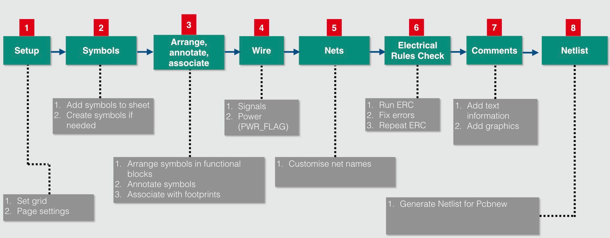

# KiCad Projects


[TOC]

## Shematics Design Process



### 1 Setup

#### 1 Setup

#### 2 Symbols

#### 3 AAA - arange, annotate, associate

#### 4 Wire

#### 5 Nets

#### 6 Electrical Rules Check

#### 7 Comments

#### 8 Netlist

## PCB Design Process


#### 1 Setup

#### 2 Outline and constraints

#### 3 Place components

#### 4 Route

#### 5 Copper Fillse

#### 6 Design Rules Check

#### 7 Manufacture

7.a) Create Gerber Files


7.b) Create Drill Files


7.c) Validate Files: 

- compress gerber folder
- upload and check: https://www.gerblook.org/

7.d) pcbway OshPark


### Plugins List

#### InteractiveHtmlBom

Create Folder and copy plugin to this directory

```
C:\Users\crtom\AppData\Roaming\kicad\scripting\plugins
```

#### Imgui - KiSymGen

KiSymGen is a cross platform utility enabling users to generate kicad schematic symbols using a graphical tool. KiSymGen is developed based on imgui and GLFW3.

Build On windows.

Tested with visual studio 2017.

- Navigate to the kisymgen folder.

- Double click on the kisymgen.sln file which should open the project in visual studio.

- Build the project and run.

  #### KiCAD Step UP - to use in FreeCAD

## Projects

###	LCD-Rpi3-HAT

-	[Readme](LCD-Rpi3-HAT/readme.md)
-	[Folder](LCD-Rpi3-HAT)
-	[KiCad Project](LCD-Rpi3-HAT/LCD-Rpi3-HAT.pro)

###	Multi-Function-Shield

-	[Readme](Multi-Function-Shield/readme.md)
-	[Folder](Multi-Function-Shield)
-	[KiCad Project](Multi-Function-Shield/Multi-Function-Shield.pro)

###	RaspberryPIFullStackHAT

-	Readme Link
-	KiCad Project Link
-	Folder Link

